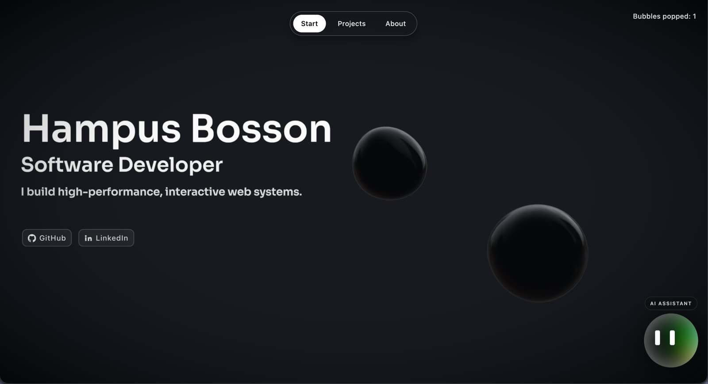
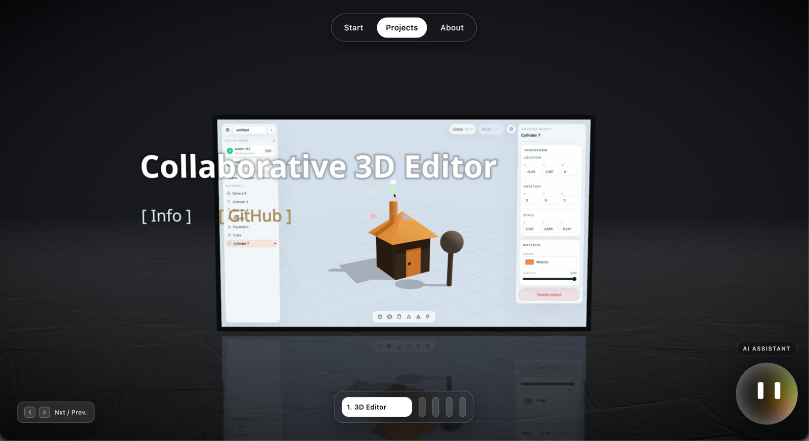
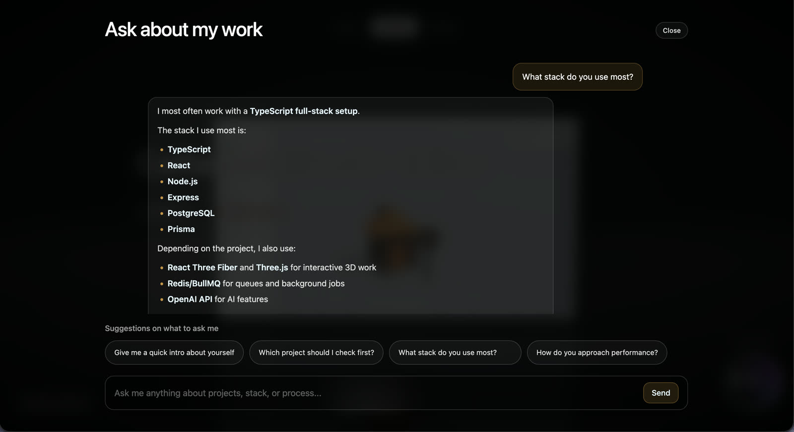

# Interactive Portfolio

An interactive portfolio built with a custom 3D frontend and a backend-powered AI assistant that answers questions about my projects, skills, and experience.

Live app: [hampusbosson.com](https://hampusbosson.com/)

## Overview

This project is both a portfolio site and a full-stack product. The frontend uses a 3D scene-based interface for navigation, while the backend provides:

- an AI chat assistant grounded in portfolio knowledge
- persistent chat history
- a contact form with email delivery
- PostgreSQL-backed storage through Prisma

## Tech Stack

### Frontend

- React
- TypeScript
- Three.js
- React Three Fiber
- Drei
- Tailwind CSS

### Backend

- Node.js
- Express
- TypeScript
- Prisma
- PostgreSQL
- OpenAI API
- Nodemailer

## Features

- 3D portfolio experience with custom camera-driven page transitions
- project showcase with video demos and detailed case study overlays
- AI assistant that answers questions about my work, projects, and technical background
- recruiter-friendly contact form with email notifications
- mobile-aware layouts for the main portfolio flows

## Screenshots

### Start Page



### Project Showcase



### AI Chat Assistant



## Local Development

### Frontend

```bash
cd frontend
npm install
npm run dev
```

### Backend

```bash
cd backend
npm install
npm run build
npm run dev
```

Create a `backend/.env` file based on `backend/.env.example` and set the required environment variables before running the backend.

## Deployment

The project is deployed with:

- Railway for hosting
- PostgreSQL for persistence
- a custom domain for the live site

The frontend and backend are deployed as separate services.
